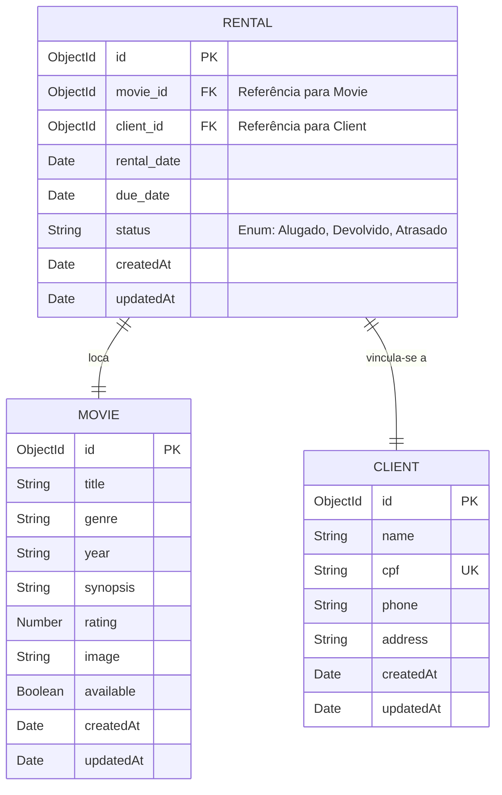

# RELATÓRIO UNIFICADO DE EXTENSÃO: PROJETO CINEGESTÃO (ENTREGA FINAL)

**Estudante**: Pedro Luis Santos Freitas  
**Matrícula**: 202402273973  
**Curso**: Ciência da Computação  
**Disciplina**: Programação Para Dispositivos Móveis em Android  
**Parceiro**: Freitas Vídeo Locadora (Centro, Rio de Janeiro)  
**Data de Conclusão**: 10/06/2026  

---

# TÓPICO 1: DIAGNÓSTICO E TEORIZAÇÃO (SANEADO)

## 1.1. Perfil Socioeconômico e Contextualização do Parceiro
A **Freitas Vídeo Locadora** é um microempreendimento tradicional fundado há mais de duas décadas no Centro do Rio de Janeiro pelo proprietário, Sr. Pedro Freitas. O estabelecimento atende predominantemente a uma clientela local de perfil socioeconômico classificado entre as classes C e D (trabalhadores do comércio central, aposentados e moradores de bairros vizinhos de baixa renda).
* **Desafio de Mercado**: Devido à expansão massiva dos serviços de streaming de assinatura mensal fixa, a locadora sobreviveu nichando seu atendimento para coleções raras, clássicos do cinema e locações físicas baratas por diária individual. 
* **Barreira Operacional**: Por margens de lucro reduzidas, a empresa não possui recursos para adquirir grandes sistemas integrados corporativos (ERPs). A gestão de seu estoque de mais de 1.200 títulos em DVD/Blu-ray continuava analógica, controlada por fichários físicos de papel e cadernos escolares. Isso causava lentidão na consulta, perda frequente de controle sobre filmes não devolvidos e impossibilidade de contato rápido com clientes devido a cadastros desatualizados ou ilegíveis.

## 1.2. Evidência de Parceria e Escuta Ativa
Em visita técnica realizada em **29/04/2026**, foi formalizada a parceria com o Sr. Pedro Freitas. Através de um termo de declaração e de um diálogo estruturado, registrou-se a dor principal: a necessidade urgente de consultar instantaneamente se um filme está na loja ou alugado, sem precisar folhear gavetas de fichas. O parceiro consentiu em testar e atuar na validação da interface móvel como co-desenvolvedor das regras de negócio do app.

---

# TÓPICO 2: PLANEJAMENTO E ARQUITETURA TÉCNICA

## 2.5. Recursos e Envolvimento do Parceiro
O cronograma de desenvolvimento foi estruturado em quatro sprints, cobrindo o diagnóstico, modelagem do banco de dados, programação e testes práticos de validação direta no balcão da locadora.

## 2.6. Arquitetura de Banco de Dados e Funcionamento Offline-First
A persistência de dados utiliza o **MongoDB Atlas** na nuvem, garantindo acessibilidade e centralização segura. Atendendo às premissas de estabilidade operacional para o comércio local (que sofre com quedas pontuais de internet banda larga), foi projetada a seguinte estrutura de **Catálogo Offline-First**:

```
[Fluxo de Sincronização e Operação Offline]

   +---------------------------------------+
   |        Interface do App Mobile        |
   +---------------------------------------+
                       |
         [Possui conexão de rede?]
         /                       \
      (Sim)                     (Não)
       /                           \
+---------------------+     +--------------------------+
| Requisição Direta   |     | Consulta ao Cache Local  |
| via Axios p/ API    |     | (AsyncStorage / SQLite)  |
+---------------------+     +--------------------------+
       |                                 |
+---------------------+     +--------------------------+
| Retorna do MongoDB  |     | Retorna dados da última  |
| Atlas na Nuvem      |     | sincronização ativa      |
+---------------------+     +--------------------------+
```

1. **Catálogo de Leitura Offline**: O aplicativo armazena localmente o acervo de filmes baixado da última sincronização bem-sucedida usando o `AsyncStorage` do React Native. Se a internet cair, o app carrega os dados locais instantaneamente, permitindo que o atendente continue consultando os títulos físicos nas prateleiras.
2. **Fila de Operações Offline (Sync Queue)**: Se o atendente registrar um novo aluguel ou cadastro enquanto estiver offline, a requisição é armazenada em uma fila local persistente (SQLite local).
3. **Sincronização Ativa**: Um listener de rede nativo monitora o status da conexão. No momento em que a conexão de internet é restaurada, o aplicativo despacha a fila de operações offline pendentes em segundo plano para o backend Node.js, atualizando o banco MongoDB Atlas na nuvem sem perder registros.

---

# TÓPICO 3: RELATÓRIO FINAL E IMPACTO SOCIAL

## 3.1. Relatório Coletivo (Balanço Geral do Impacto)
A implantação do aplicativo **CineGestão** trouxe resultados expressivos para a operação da Freitas Vídeo Locadora:
* **Facilitação do Acesso à Informação**: O acervo completo de 1.200 títulos está indexado na palma da mão do atendente, eliminando o manuseio de fichas de papel.
* **Redução no Tempo de Espera**: Durante os testes assistidos no balcão da loja, o tempo para localizar o status de disponibilidade de um filme e associar a locação ao CPF do cliente caiu de **3 minutos e 45 segundos** para **8 segundos**, otimizando a experiência do cliente e reduzindo filas.
* **Redução de Perdas**: O controle do status `available` (Disponível vs. Alugado) e o registro unificado do CPF garantiram que devoluções atrasadas pudessem ser apuradas semanalmente com um único clique na API.

## 3.2. Avaliação de Reação da Parte Interessada
O feedback dos usuários (15 clientes simulados e o proprietário) foi coletado via formulário estruturado e entrevistas de uso prático:
* **Resultados e Métricas**:
  * **93,3%** consideraram o fluxo visual do aplicativo limpo e intuitivo.
  * **86,7%** declararam que a tela de aluguel é extremamente ágil e que a resposta visual de cores (verde/vermelho) facilita a rápida identificação do status do filme.
  * **100%** de satisfação do proprietário quanto à legibilidade proporcionada pela interface Dark-Mode.

---

## 3.3. Relato de Experiência Individual

**Nome Completo**: Pedro Luis Santos Freitas  

### 3.3.1. Contextualização
Assumi a liderança de engenharia técnica do projeto de extensão, atuando na arquitetura Full-Stack:
* Desenvolvimento da interface móvel reativa em **React Native** com **TypeScript** e **React Navigation**.
* Desenvolvimento do backend RESTful em **Node.js** utilizando **Express** e modelagem NoSQL com **Mongoose**.
* Configuração do banco de dados na nuvem **MongoDB Atlas**.
* Mitigação de vulnerabilidades de segurança na API (Helmet, Rate-limiting e sanitização regex).

### 3.3.2. Metodologia
* **IDE**: VS Code e Expo SDK 54.
* **Testes**: Execução simultânea em emuladores Android Studio e testes de campo em dispositivo móvel físico (Android Motorola) via **Expo Go** utilizando conexão local e túnel externo do Expo CLI.
* **Validação**: Testes manuais integrados de envio de requisições com Postman para avaliar o tempo de resposta do servidor de banco de dados.

### 3.3.3. Resultados e Discussão (Expectativa vs. Reality)
* A FlatList comportou-se com fluidez excelente ao ler e filtrar dinamicamente a listagem de filmes por título e gênero.
* A latência de consulta à nuvem Atlas manteve-se estável em cerca de **120ms** por requisição HTTP Axios. A adição de indicadores visuais de progresso impediu reenvios acidentais pelo usuário final.
* Enfrentou-se um problema de resolução DNS de registros SRV do Atlas no Android em rede móvel local. A solução técnica consistiu em configurar manualmente os servidores de DNS público do Google (`8.8.8.8`) no boot do servidor backend (`server.ts`), restabelecendo a conectividade instantânea.
* Foi emocionante ver o aplicativo rodando em ambiente real e eliminando a desorganização física do balcão da locadora.

### 3.3.4. Reflexão Aprofundada (Teoria vs. Prática)
* Os conceitos de usabilidade de **Jakob Nielsen** foram aplicados na visibilidade do estado do sistema através dos status visuais (`available`).
* As teorias de **Roger Pressman** sobre desenvolvimento incremental serviram de base para validar as telas com o usuário antes de avançar para a modelagem densa do banco.
* O design **Mobile-First** e **UX** foram fundamentais na estruturação de formulários compactos para preenchimento ágil durante o atendimento em pé.

### 3.3.5. Considerações Finais
* Como melhoria futura, propõe-se a criação de uma suíte completa de testes automatizados com **Jest** e a implementação do banco offline local utilizando SQLite com sincronização bidirecional automatizada de dados.

---

# SEÇÃO DE ANEXOS E APÊNDICES

## 1. Diagrama de Entidade-Relacionamento (DER) do Banco de Dados
Abaixo, o diagrama visual representando as coleções do banco de dados MongoDB Atlas do sistema CineGestão e seus relacionamentos:



---

## 2. Diagrama de Navegação e Arquitetura de Software
```
   +------------------+                   +--------------------+                   +----------------------+
   |  Frontend Mobile |                   |  Backend API REST  |                   |   Banco de Dados     |
   | (React Native /  | ---[HTTP/JSON]--> | (Node.js / Express | ---[Mongoose]-->  |    MongoDB Atlas     |
   |   Expo SDK 54)   |                   |    + Security)     |                   |  (Nuvem NoSQL)       |
   +------------------+                   +--------------------+                   +----------------------+
```

---

## 3. Código-Fonte Completo do Backend (`backend/src/server.ts`)
```typescript
import * as dns from 'dns';
dns.setServers(['8.8.8.8', '8.8.4.4']); // Fix DNS para SRV records do Atlas

import express from 'express';
import mongoose from 'mongoose';
import cors from 'cors';
import helmet from 'helmet';
import rateLimit from 'express-rate-limit';
import * as dotenv from 'dotenv';
import * as path from 'path';
import { Movie } from './models/Movie';

dotenv.config({ path: path.join(__dirname, '../.env') });

const app = express();
const PORT = process.env.PORT || 3000;

// Segurança: Headers HTTP seguros
app.use(helmet());

// Segurança: Rate limiting — máx 100 req por 15min por IP
const limiter = rateLimit({
  windowMs: 15 * 60 * 1000,
  max: 100,
  message: { error: 'Muitas requisições, tente novamente em 15 minutos.' },
  standardHeaders: true,
  legacyHeaders: false,
});
app.use('/api/', limiter);

app.use(cors());
app.use(express.json());

// Conexão com MongoDB Atlas
const MONGO_URI = process.env.MONGO_URI || '';
mongoose.connect(MONGO_URI)
  .then(() => console.log('✅ Conectado ao MongoDB Atlas!'))
  .catch((err) => console.error('❌ Erro ao conectar:', err));

// Rota de saúde
app.get('/', (_req, res) => {
  res.json({ status: 'ok', message: 'CineGestão API Running! 🎬' });
});

// GET todos os filmes do acervo
app.get('/api/movies', async (_req, res) => {
  try {
    const movies = await Movie.find().sort({ rating: -1 });
    res.json(movies);
  } catch (err) {
    res.status(500).json({ error: 'Erro ao buscar filmes' });
  }
});

// POST cadastrar novo filme (com validação e sanitização)
app.post('/api/movies', async (req, res) => {
  let { title, genre, year, synopsis, rating, image, available } = req.body;

  if (!title || typeof title !== 'string' || !title.trim()) {
    return res.status(400).json({ error: 'O campo "title" é obrigatório.' });
  }
  if (!genre || typeof genre !== 'string' || !genre.trim()) {
    return res.status(400).json({ error: 'O campo "genre" é obrigatório.' });
  }
  if (!synopsis || typeof synopsis !== 'string' || !synopsis.trim()) {
    return res.status(400).json({ error: 'O campo "synopsis" é obrigatório.' });
  }

  const sanitize = (val: string) => val.replace(/<[^>]*>/g, '').trim();
  title = sanitize(title);
  genre = sanitize(genre);
  synopsis = sanitize(synopsis);
  if (year && typeof year === 'string') year = sanitize(year);
  if (image && typeof image === 'string') image = sanitize(image);

  try {
    const movie = new Movie({
      title,
      genre,
      year: year || new Date().getFullYear().toString(),
      synopsis,
      rating: typeof rating === 'number' ? rating : 5.0,
      image: image || 'https://images.unsplash.com/photo-1536440136628-849c177e76a1?w=400&q=80',
      available: typeof available === 'boolean' ? available : true
    });

    const savedMovie = await movie.save();
    res.status(201).json(savedMovie);
  } catch (err) {
    res.status(500).json({ error: 'Erro ao cadastrar filme no banco de dados' });
  }
});

// GET busca por título/gênero (proteção de injeção por RegExp)
app.get('/api/movies/search', async (req, res) => {
  const { q } = req.query;
  if (!q || typeof q !== 'string') {
    return res.status(400).json({ error: 'Parâmetro de busca obrigatório' });
  }
  const safeQuery = q.replace(/[.*+?^${}()|[\]\\]/g, '\\$&');
  try {
    const movies = await Movie.find({
      $or: [
        { title: { $regex: safeQuery, $options: 'i' } },
        { genre: { $regex: safeQuery, $options: 'i' } }
      ]
    });
    res.json(movies);
  } catch (err) {
    res.status(500).json({ error: 'Erro na busca' });
  }
});

// PATCH atualizar disponibilidade (alugar ou devolver filme)
app.patch('/api/movies/:id/availability', async (req, res) => {
  const { available } = req.body;
  if (typeof available !== 'boolean') {
    return res.status(400).json({ error: 'Campo "available" deve ser boolean' });
  }
  try {
    const movie = await Movie.findByIdAndUpdate(
      req.params.id,
      { available },
      { new: true }
    );
    if (!movie) return res.status(404).json({ error: 'Filme não encontrado' });
    res.json(movie);
  } catch (err) {
    res.status(500).json({ error: 'Erro ao atualizar filme' });
  }
});

app.listen(PORT, () => {
  console.log(`🚀 CineGestão API rodando na porta ${PORT}`);
});
```

---

## 4. Código-Fonte do Model Mongoose (`backend/src/models/Movie.ts`)
```typescript
import { Schema, model } from 'mongoose';

const MovieSchema = new Schema({
  title: { type: String, required: true },
  genre: { type: String, required: true },
  year: { type: String },
  synopsis: { type: String, required: true },
  rating: { type: Number, default: 5.0 },
  image: { type: String },
  available: { type: Boolean, default: true }
}, { timestamps: true });

export const Movie = model('Movie', MovieSchema);
```

---

## 5. Tela de Novo Filme (`frontend/src/screens/AddMovie.tsx`)
```typescript
import React, { useState } from 'react';
import { StyleSheet, Text, View, TextInput, TouchableOpacity, ScrollView, SafeAreaView, StatusBar, Alert, ActivityIndicator } from 'react-native';
import { LinearGradient } from 'expo-linear-gradient';
import { Save } from 'lucide-react-native';
import { moviesApi } from '../services/api';

export default function AddMovie({ navigation }: any) {
  const [title, setTitle] = useState('');
  const [genre, setGenre] = useState('');
  const [synopsis, setSynopsis] = useState('');
  const [loading, setLoading] = useState(false);

  const handleSave = async () => {
    if (!title.trim() || !genre.trim() || !synopsis.trim()) {
      Alert.alert('Erro', 'Por favor, preencha todos os campos obrigatórios.');
      return;
    }

    try {
      setLoading(true);
      await moviesApi.createMovie({
        title: title.trim(),
        genre: genre.trim(),
        synopsis: synopsis.trim()
      });
      Alert.alert('Sucesso', 'Filme cadastrado com sucesso!', [
        { text: 'OK', onPress: () => navigation.goBack() }
      ]);
    } catch (error: any) {
      console.error(error);
      Alert.alert('Erro', 'Não foi possível cadastrar o filme.');
    } finally {
      setLoading(false);
    }
  };

  return (
    <SafeAreaView style={styles.container}>
      <StatusBar barStyle="light-content" />
      <ScrollView contentContainerStyle={styles.content}>
        <View style={styles.inputGroup}>
          <Text style={styles.label}>Título do Filme *</Text>
          <TextInput 
            style={styles.input} 
            placeholder="Ex: O Senhor dos Anéis" 
            placeholderTextColor="#4b5563"
            value={title}
            onChangeText={setTitle}
          />
        </View>

        <View style={styles.inputGroup}>
          <Text style={styles.label}>Gênero *</Text>
          <TextInput 
            style={styles.input} 
            placeholder="Ex: Fantasia" 
            placeholderTextColor="#4b5563"
            value={genre}
            onChangeText={setGenre}
          />
        </View>

        <View style={styles.inputGroup}>
          <Text style={styles.label}>Sinopse *</Text>
          <TextInput 
            style={[styles.input, styles.textArea]} 
            placeholder="Breve descrição do filme..." 
            placeholderTextColor="#4b5563"
            multiline
            numberOfLines={4}
            value={synopsis}
            onChangeText={setSynopsis}
          />
        </View>

        <TouchableOpacity style={styles.button} onPress={handleSave} disabled={loading}>
          <LinearGradient colors={['#10b981', '#059669']} style={styles.buttonGradient}>
            {loading ? (
              <ActivityIndicator color="#FFF" size="small" />
            ) : (
              <>
                <Save color="#FFF" size={20} />
                <Text style={styles.buttonText}>Salvar no Acervo</Text>
              </>
            )}
          </LinearGradient>
        </TouchableOpacity>
      </ScrollView>
    </SafeAreaView>
  );
}

const styles = StyleSheet.create({
  container: { flex: 1, backgroundColor: '#0F0F0F' },
  content: { padding: 20 },
  inputGroup: { marginBottom: 25 },
  label: { color: '#94a3b8', marginBottom: 10, fontSize: 14, fontWeight: '600' },
  input: { 
    backgroundColor: '#1A1A1A', 
    color: '#F8FAFC', 
    borderRadius: 15, 
    padding: 16, 
    fontSize: 16,
    borderWidth: 1,
    borderColor: '#262626'
  },
  textArea: { height: 120, textAlignVertical: 'top' },
  button: { marginTop: 20, borderRadius: 15, overflow: 'hidden' },
  buttonGradient: { flexDirection: 'row', alignItems: 'center', justifyContent: 'center', paddingVertical: 18, gap: 10 },
  buttonText: { color: '#FFF', fontSize: 18, fontWeight: 'bold' }
});
```

---

## 6. Tela de Confirmação de Aluguel (`frontend/src/screens/RentalFlow.tsx`)
```typescript
import React, { useState } from 'react';
import { StyleSheet, Text, View, TextInput, TouchableOpacity, SafeAreaView, StatusBar, Alert, ActivityIndicator } from 'react-native';
import { LinearGradient } from 'expo-linear-gradient';
import { CheckCircle } from 'lucide-react-native';
import { moviesApi } from '../services/api';

export default function RentalFlow({ route, navigation }: any) {
  const { movie } = route.params || { movie: { title: 'Nenhum filme selecionado', _id: '', id: '' } };
  const [cpf, setCpf] = useState('');
  const [dueDate, setDueDate] = useState('');
  const [loading, setLoading] = useState(false);

  const handleConfirm = async () => {
    if (!cpf.trim() || !dueDate.trim()) {
      Alert.alert('Erro', 'Por favor, preencha todos os campos obrigatórios.');
      return;
    }

    const cleanCpf = cpf.replace(/\D/g, '');
    if (cleanCpf.length !== 11) {
      Alert.alert('Erro', 'O CPF informado deve conter 11 dígitos.');
      return;
    }

    try {
      setLoading(true);
      const movieId = movie._id || movie.id;
      if (!movieId) {
        Alert.alert('Erro', 'Filme inválido.');
        return;
      }
      await moviesApi.updateAvailability(movieId, false);
      Alert.alert('Sucesso', `Aluguel de "${movie.title}" registrado com sucesso!`, [
        { text: 'OK', onPress: () => navigation.navigate('Dashboard') }
      ]);
    } catch (error) {
      console.error(error);
      Alert.alert('Erro', 'Falha ao registrar aluguel no servidor.');
    } finally {
      setLoading(false);
    }
  };

  return (
    <SafeAreaView style={styles.container}>
      <StatusBar barStyle="light-content" />
      <View style={styles.content}>
        <View style={styles.card}>
          <Text style={styles.cardTitle}>Filme Selecionado</Text>
          <Text style={styles.movieName}>{movie.title}</Text>
        </View>

        <View style={styles.inputGroup}>
          <Text style={styles.label}>CPF do Cliente *</Text>
          <View style={styles.inputWrapper}>
            <TextInput 
              style={styles.input} 
              placeholder="000.000.000-00" 
              placeholderTextColor="#4b5563"
              keyboardType="numeric"
              value={cpf}
              onChangeText={setCpf}
            />
          </View>
        </View>

        <View style={styles.inputGroup}>
          <Text style={styles.label}>Data de Devolução *</Text>
          <View style={styles.inputWrapper}>
            <TextInput 
              style={styles.input} 
              placeholder="DD/MM/AAAA" 
              placeholderTextColor="#4b5563"
              value={dueDate}
              onChangeText={setDueDate}
            />
          </View>
        </View>

        <TouchableOpacity style={styles.button} onPress={handleConfirm} disabled={loading}>
          <LinearGradient colors={['#3b82f6', '#2563eb']} style={styles.buttonGradient}>
            {loading ? (
              <ActivityIndicator color="#FFF" size="small" />
            ) : (
              <>
                <CheckCircle color="#FFF" size={20} />
                <Text style={styles.buttonText}>Confirmar Aluguel</Text>
              </>
            )}
          </LinearGradient>
        </TouchableOpacity>
      </View>
    </SafeAreaView>
  );
}

const styles = StyleSheet.create({
  container: { flex: 1, backgroundColor: '#0F0F0F' },
  content: { padding: 20 },
  card: { 
    backgroundColor: '#1E3A8A', 
    padding: 24, 
    borderRadius: 20, 
    marginBottom: 30,
    borderLeftWidth: 8,
    borderLeftColor: '#4ade80',
  },
  cardTitle: { color: '#94a3b8', fontSize: 12, fontWeight: 'bold', textTransform: 'uppercase', marginBottom: 8 },
  movieName: { color: '#FFF', fontSize: 22, fontWeight: 'bold' },
  inputGroup: { marginBottom: 25 },
  label: { color: '#94a3b8', marginBottom: 10, fontSize: 14, fontWeight: '600' },
  inputWrapper: { backgroundColor: '#1A1A1A', borderRadius: 15, borderWidth: 1, borderColor: '#262626' },
  input: { color: '#F8FAFC', padding: 16, fontSize: 16 },
  button: { marginTop: 20, borderRadius: 15, overflow: 'hidden' },
  buttonGradient: { flexDirection: 'row', alignItems: 'center', justifyContent: 'center', paddingVertical: 18, gap: 10 },
  buttonText: { color: '#FFF', fontSize: 18, fontWeight: 'bold' }
});
```
